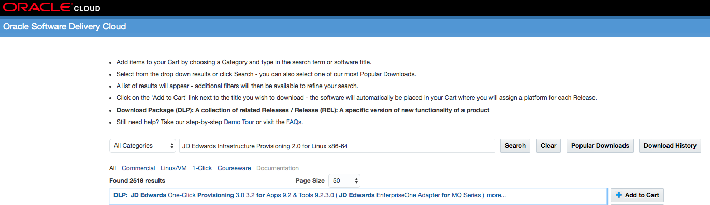
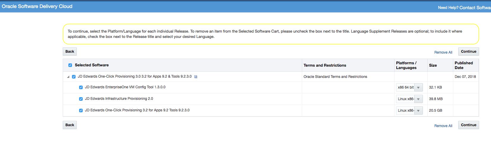
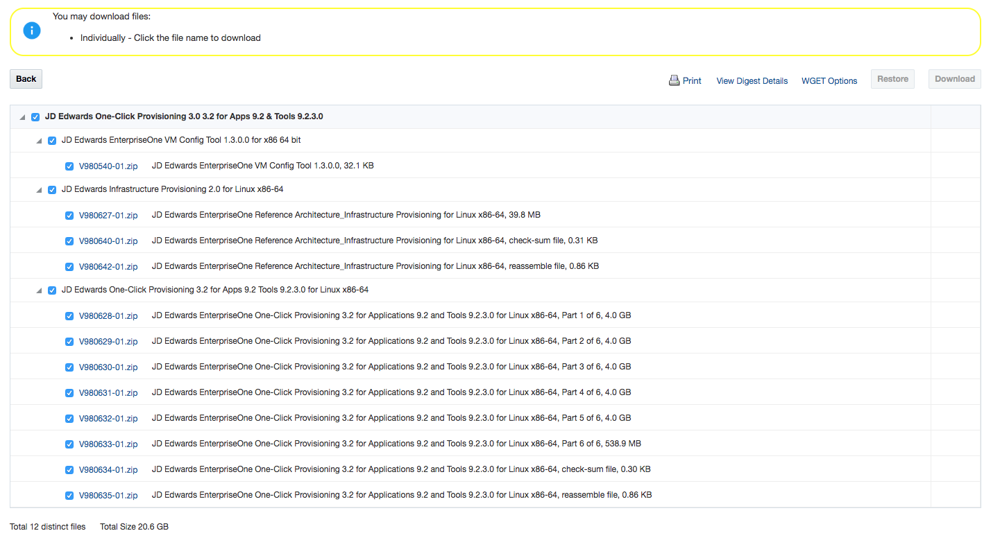
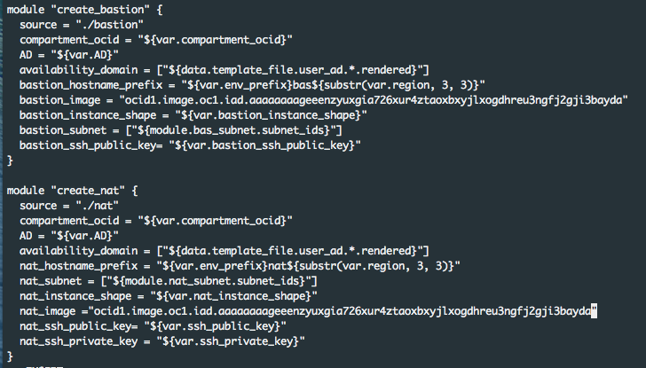

# JD Edwards Lift and Shift Guide

  
  
  
**Welcome to the JD Edwards Lift and Shift Workshop and JD Edwards General User Guide. This workshop will walk you through the process of how to lift and shift your current JD Edwards environment into the cloud.** 

## Table of Contents
* [Prerequisite Tools and Resources](#prerequisite-tools-and-resources)
* [Understanding Port Restrictions](#understanding-port-restrictions)
  + [One-Click Provisioning Console for JD Edwards](#one-click-provisioning-console-for-jd-edwards)
  + [All Internet Browsers](#all-internet-browsers)
  + [Google Chrome and Mozilla Firefox Browsers](#google-chrome-and-mozilla-firefox-browsers)
  + [Acquire an Oracle Cloud Trial or Workshop Account](#acquire-an-oracle-cloud-trial-or-workshop-account)
* [Before You Begin](#before-you-begin)
  + [Background](#background)
  + [What Do You Need?](#what-do-you-need)
* [Generating Secure Shell (SSH) Key Pairs on Your Local System](#generating-secure-shell)
* [Creating a Compartment](#creating-a-compartment)
* [Creating a Virtual Cloud Network](#creating-a-virtual-cloud-network)
* [Creating a Linux Instance for the Terraform Staging Server](#creating-a-linux-instance-for-the-terraform-staging-server)
* [Creating Additional Block Volumes for a Linux Instance](#creating-additional-block-volumes-for-a-linux-instance)
* [Attaching the Block Volumes](#attaching-the-block-volumes)
* [Run iSCSI Commands to Complete the Attachment and Mount of the Block Volume](#run-iscsi-commands-to-complete-the-attachment-and-mount-of-the-block-volume)
* [Running Linux Commands to Set Up the Terraform Staging Server](#running-linux-commands-to-set-up-the-terraform-staging-server)
* [Accessing the Terraform Staging Server Through the Virtual Network Computing (VNC) Viewer](#accessing-the-terraform-staging-server-through-the-virtual-network-computing--vnc--viewer)
* [Copying Your Private SSH Keys to the Terraform Staging Server](#copying-your-private-ssh-keys-to-the-terraform-staging-server)
- [Setting Up the Terraform Staging Server: Configuring a User for Infrastructure Provisioning](#setting-up-the-terraform-staging-server--configuring-a-user-for-infrastructure-provisioning)
  - [Generating a Public Key for the Infrastructure Provisioning User](#generating-a-public-key-for-the-infrastructure-provisioning-user)
  - [Adding the Public Key as an API Key for the Infrastructure Provisioning User](#adding-the-public-key-as-an-api-key-for-the-infrastructure-provisioning-user)
  - [Locating a Fingerprint for the Infrastructure Provisioning User](#locating-a-fingerprint-for-the-infrastructure-provisioning-user)
  - [Determining the OCID for the Infrastructure Provisioning User](#determining-the-ocid-for-the-infrastructure-provisioning-user)
* [Generating CA Certificates](#generating-ca-certificates)
  

## Prerequisite Tools and Resources

The PuTTY tool (http://www.putty.org) for generating SSH key pairs on the client machine that you will use to connect to any Linux server deployed by One-Click Provisioning.

The table below specifies the minimum Oracle Cloud Infrastructure resource requirements to install and run JD Edwards. Your environment may require additional resources based on transaction volumes, number of users, availability requirement, integrations, and business requirements.

## Understanding Port Restrictions

You should be aware of restricted ports that cannot be defined or used while creating any web component and/or server. These specific port restrictions for any One-Click Provisioning deployment of JD Edwards EnterpriseOne are grouped as follows:
* One-Click Provisioning Console for JD Edwards
* All Internet Browsers
* Google Chrome and Mozilla Firefox Browsers

### One-Click Provisioning Console for JD Edwards
Any port below 1024 is restricted.

### All Internet Browsers
The following are restricted ports enforced by the rules of any internet browser:
* 2049
* 4045
* 6000

### Google Chrome and Mozilla Firefox Browsers
In addition to the above mentioned restricted ports for any internet browser, the Google Chrome and Mozilla Firefox browsers block specific ports which they deem as unsafe to use on HTTP/HTTPS protocol. Below are these restricted ports:
* 3659, // apple-sasl / PasswordServer
* 6665, // Alternate IRC [Apple addition]
* 6666, // Alternate IRC [Apple addition]
* 6667, // Standard IRC [Apple addition]
* 6668, // Alternate IRC [Apple addition]
* 6669, // Alternate IRC [Apple addition]

### Acquire an Oracle Cloud Trial or Workshop Account

- Bookmark this page for future reference.

- Please click on the following link to create your <a href="https://cloud.oracle.com/tryit" target="_trial">Free Account</a> and complete all the required steps to get your free Oracle Cloud Trial Account. When you complete the registration process you'll receive a $300 credit that will enable you to complete the lab for free.  Additionally, you'll have 1000s of hours left over to continue to explore the Oracle Cloud.
  
  
> NOTE: You may proceed to the section below if you already have the access and credentials.

Before You Begin
----------------

This 15-minute tutorial shows you how to generate instance SSH key pairs in openssh format on your local system, which can be UNIX or Windows. Key pairs in this format are required if you need to connect directly to any Linux instance.

Best practice is to generate two sets of keys pairs:

-   **Key pair for access to the Bastion host.** This key pair is use for production purposes to access the Bastion host which in turn securely connects to all the other servers in the JD Edwards EnterpriseOne environment deployed by Infrastructure Provisioning. **Tip:** For organizational purposes, you should give these keys a significant name tying them to their use, like Bastion.pub and **Bastion.ppk**.
-   **Key pair for access to all hosts created by Infrastructure Provisioning except the Bastion host.** The use case for such connections are not for production purposes; for example these would be required in cases where Troubleshooting an instance might be necessary. Tip: For organizational purposes, you should give these keys a significant name tying them to their use, like **OCI_Instance.pub** and OCI_Instance.ppk.

### Background

JD Edwards EnterpriseOne Infrastructure Provisioning uses multiple methods of securely connection to Oracle Cloud Infrastructure, where "key pairs" means a Public Key and a Private Key:

1.  **Instance Key Pair.** Secure Shell (SSH) provides an encrypted login method that is a more secure replacement for Telnet for logging on to Oracle Cloud Infrastructure. Before you can use Infrastructure Provisioning to create instances, you must generate **Instance Key Pairs** and upload the SSH Public Key to Oracle Cloud Infrastructure. This SSH Public Key is used for authentication for any Oracle Cloud Infrastructure instance except the Bastion Server. The generation of this key pair is described in this section of this Learning Path entitled: ***Generating Instance Key Pairs in openssh Format***.

2.  **Bastion Host Key Pair**. This key pair is similar to **Instance Key Pairs** but are strongly recommended as best practice for the highest level of security. That is, you should the same procedure to create a different set of **Bastion Host Key Pairs** for public production access to the Bastion host, while keeping access to other host instances securely separated. The generation of these keys is described in this section of this Learning Path entitled: ***Generating Instance Key Pairs in openssh Format***.
3.  **Infrastructure Provisioning User Key Pair**. Instead of SSH key format, this key pair must be generated in Privacy Enhanced Mail (PEM) container format. The Public key of this key pair must be added to the account for the Infrastructure Provisioning User. When this Public key is uploaded, the system automatically creates a fingerprint that is displayed in the console of Oracle Cloud Infrastructure and is required for input into the Infrastructure Provisioning Console. In order to enable provisioning in Oracle Cloud Infrastructure, the Private key of this key pair is required as an input in the Infrastructure Provisioning Console.. The generation of this key pair, along with associated functions, are described in the section of this Learning Path entitled: ***Configuring a User for Infrastructure Provisioning***. 
4.  **CA Certificates.** You must generate CA certificates in order to support Load Balancing as a Service (LBaaS), which is core functionality that is deployed and configured by JD Edwards EnterpriseOne Infrastructure Provisioning. These certificates are used to configure LBaaS with SSL.  The procedure is described in the section of this Learning Path entitled: ***Generating CA Certificates for Load Balancing as a Service (LBaaS***). 

**Tip:** Best practice is to create at least two SSH key pairs for each purpose, because if for any reason a single SSH Key is no longer valid, access to the server would be lost permanently with no means to recover. There is no access to the server without using an SSH Key. Additional keys can be added manually after the instance is started.

**Warning:** Use caution if prompted to overwrite a previously generated SSH Key. If you overwrite a key previously used to connect to a prior Oracle Cloud Infrastructure instance, you may permanently lose access to (that is, the ability to log in to) any prior Oracle Cloud Infrastructure instance that used that key.

### What Do You Need?

Depending on your systems, you will need to create SSH key pairs either on a UNIX local system or on a Microsoft Windows local system.

-   **UNIX Local Systems**. If you are generating he **ssh-keygen** utility is required for generating SSH key pairs that you will use to connect to Oracle Cloud Infrastructure Compute Classic. Many UNIX installations already include ssh-keygen. Run the ssh-keygen command to verify that your installation has this utility; otherwise, you may obtain OpenSSH from this link:

    <http://www.openssh.com/portable.html>

    **Note:** All references to UNIX also apply to Linux.

-   **Microsoft Windows Local Systems.** The PuTTY key generator is required for generating SSH key pairs. The utility is available at this link:

    <http://www.putty.org>

* * * * *

Generating Secure Shell (SSH) Key Pairs on Your Local System
------------------------------------------------------------------------------------------------------------------------------

Secure SHell (SSH) provides an encrypted login method that is a more secure replacement for Telnet for logging on to the JD Edwards One-Click Provisioning Server on the Oracle Cloud Infrastructure. Before you create your Oracle Cloud Infrastructure instance, you must generate SSH key pairs and upload the SSH public keys to Oracle Cloud Infrastructure. These SSH public keys will be used for authentication when you log in to the instance. You must also create pairs of private keys, one pair for use by the One-Click Provisioning Server to create instances for JD Edwards EnterpriseOne servers and another pair to enable access to the instances. Below is a summary of the required SSH keys and their formats:

**Note:** You cannot set a passphrase for any SSH key (for example, provisioning user keys, Oracle Cloud Infrastructure instance keys, or Bastion Server keys).

-   **Public Key in OpenSSH Format**\
    Required when creating an instance for the Provisioning Server instance.

    See Step 4 in the following procedure.

-   **Private Key in OpenSSH Linux/UNIX Format**\
    Required as an input value to the One-Click Provisioning Console which uses the SSH keys to create instances for JD Edwards EnterpriseOne servers.

    See Step 5 in the following procedure.
-   **Private Key in .ppk Microsoft Windows Format**\
    Required to connect from a Microsoft Windows machine to an Oracle Cloud Service instance including the Provisioning Server itself and also to connect to any provisioned server such as DBCS, Enterprise Server, and JCS servers (such as HTML and AIS servers).

    See Step 6 in the following procedure.

1.  Locate and run **puttygen.exe** in the PuTTY folder of your local Microsoft Windows computer.
2.  On PuTTY Key Generator, accept the default key type, **SSH-2 RSA**, and in the **Number of bits in a generated key:** field, ensure the value is set to **2048**.
3.  Click the **Generate** button.

    

    [PuTTY Key Generator](https://docs.oracle.com/en/applications/jd-edwards/tutorial-generate-ssh-keypair_terra/files/PuTTY_Key_Generator.txt)

    After you have clicked the **Generate** button, move your mouse around the blank area to generate randomness for the SSH key pair you generate.

    

    [PuTTY Key Generator](https://docs.oracle.com/en/applications/jd-edwards/tutorial-generate-ssh-keypair_terra/files/PuTTY_Key_Generator_Generate.txt)

4.  Use this step to create a Public Key in OpenSSH Format.

    1.  In the PuTTY Key Generator dialog, select all the characters in the **Public key for pasting into OpenSSH authorized_keys file** field.\
        **Note:** Be sure you select all the characters, not just the ones you can see in the narrow window. If a scroll bar appears next to the characters, scroll through the entire window to select all the characters.
    2.  On the selected text, right-click to show the context menu and select **Copy**.

        

        [PuTTY Key Generator - Public Key](https://docs.oracle.com/en/applications/jd-edwards/tutorial-generate-ssh-keypair_terra/files/PuTTY_Key_Generator_Public_Key.txt)

    3.  Open a plain text editor (such as vi on UNIX or Notepad on Microsoft Windows) and paste in the characters you just copied. Ensure that you paste the text at the first character in the text editor, and do not insert any line breaks.
    4.  Save the plain text file as a file name with a .pub extension and keep a record of the file name.

        **Tip:** As mentioned in the ***Before You Begin*** section of this task, for organizational purposes, you should give these keys a significant name tying them to their use, like **Bastion.pub** for the Bastion server and OCI_Instance.pub for Oracle Cloud Infrastructure instances.

        **Note:** The key saved in this step will save the first key of a key pair as recommended in the preceding\
        **Tip** just prior to the first step of this procedure.

    5.  Click the **Save public key** button to save the key to a file.

        **Tip:** You may give the file for the key any extension, but .pub is a useful convention to indicate that this is a public key.

        **Note:** The key saved in this step will save a second key of a key pair as recommended in the preceding **Tip** just prior to the first step of this procedure.

    6.  Keep a record of the file name and location which you will need when you upload this key when you create an instance and for other purposes as well.
    7.  Repeat this step to create another key pair, where one key pair will be for accessing the Bastion host, and the other key pair will be for accessing all other Oracle Cloud Infrastructure instances by tunneling through the Bastion host.
5.  Use this step to create a Private Key in OpenSSH Linux/UNIX Format.

    1.  In the PuTTY Key Generator dialog, from the menu bar, select Conversions > Export OpenSSH key.

        

        [PuTTY Key Generator - Conversions > Export OpenSSH Key in Linux/UNIX Format](https://docs.oracle.com/en/applications/jd-edwards/tutorial-generate-ssh-keypair_terra/files/conversions_export_openSSH.txt)

    2.  On PuTTYgen Warning, click the **Yes** button to confirm you want to create the Private Key without a passphrase.

    

    [PuTTY Warning - Click No](https://docs.oracle.com/en/applications/jd-edwards/tutorial-generate-ssh-keypair_terra/files/no_passphrase.txt)

    4.  Keep a record of the file name and location, which you will need when you upload this key as prompted by the One-Click Provisioning Console.

        **Tip:** As mentioned in the ***Before You Begin*** section of this task, for organizational purposes, you should give these keys a significant name tying them to their use, like **Bastion.openssh** for the Bastion server and OCI_Instance.openssh for Oracle Cloud Infrastructure instances.

1.  Use this step to create a Private Key in .ppk Microsoft Windows Format.

    1.  In the PuTTY Key Generator dialog, click the **Save private key** button to save your private key to the system.
    2.  The **Key comment** is the name of the key. You may keep the generated key comment or create your own.
    3.  Do not enter a **Key passphrase**.
    4.  To save the private key in the PuTTY Private Key (PPK) format, click the **Save private key** button.\
        **Note:** The PuTTY Private Key (PPK) format works only with the PuTTY toolset.

    

    [PuTTY Key Generator](https://docs.oracle.com/en/applications/jd-edwards/tutorial-generate-ssh-keypair_terra/files/PuTTY_Key_Generator_Save.txt)

    6.  On PuTTYgen Warning, click the **Yes** button to confirm you want to create the Private Key without a passphrase.

        

        [PuTTY Warning - Click No](https://docs.oracle.com/en/applications/jd-edwards/tutorial-generate-ssh-keypair_terra/files/no_passphrase.txt)

    7.  Keep a record of the file name and location which you will need when you upload this key from a Microsoft Windows machine that is accessing the JD Edwards EnterpriseOne One-Click Provisioning Server and any JD Edwards EnterpriseOne server that it has deployed.

        **Important:** The file name you specify for this Private Key must have a .ppk extension.\\
        **Tip:** As mentioned in the ***Before You Begin*** section of this task, for organizational purposes, you should give these keys a significant name tying them to their use, like **Bastion.ppk** for the Bastion server and **OCI_Instance.ppk** for Oracle Cloud Infrastructure instances.
    8.  Repeat this step to create another Private key pair, where one key pair will be for accessing the Bastion host, and the other key pair will be for accessing all other Oracle Cloud Infrastructure instances by tunneling through the Bastion host.

Creating a Compartment
----------------------

To create a Compartment for JD Edwards EnterpriseOne on Oracle Cloud Infrastructure:

1.  As the user for which you will create a public key to access the Terraform Staging Server, log in to Oracle Cloud Infrastructure using the following URL for the tenancy in which you want to provisioning infrastructure using the JD Edwards EnterpriseOne Infrastructure Provisioning Console:

    https://console.<your_region-ad>.oraclecloud.com/#/a/

    For example:

    https://console.us-ashburn-1.oraclecloud.com/#/a/
2.  On the Oracle Cloud Infrastructure Console Home page, click the **Navigation Menu** in the upper-left corner.

    

    [Navigation Menu - Compartments](https://docs.oracle.com/en/applications/jd-edwards/tutorial-create-compartment-ref/files/using_the_console.txt)

3.  From the Navigation Menu, in the **Identity** section, click to select the **Compartment** service.
4.  In the **Compartments** section, click the **Create Compartment** button.

[Oracle Cloud Infrastructure Console - Identity > Compartment > Create Compartment](https://docs.oracle.com/en/applications/jd-edwards/tutorial-create-compartment-ref/files/identity_compartment.txt)

6.  On the Create Compartment dialog, complete these fields:

-   *Name*\
    Enter a name for the compartment.
-   *Description*\
    Enter a description for the compartment.
-   *Tags*\
    Optionally you can enter tag information in these fields. For more information, click the link in the dialog for Learn more about tagging.

8.  Click the **Create Compartment** button.

[Create Compartment Dialog](https://docs.oracle.com/en/applications/jd-edwards/tutorial-create-compartment-ref/files/create_compartment_dialog.txt)

Creating a Virtual Cloud Network
--------------------------------

To create a VCN on Oracle Cloud Infrastructure:

1.  On the Oracle Cloud Infrastructure Console Home page, click the **Navigation Menu** in the upper-left corner.

    

    [Navigation Menu - Networking > Virtual Cloud Networks](https://docs.oracle.com/en/applications/jd-edwards/tutorial-create-virtual-cloud-network-terra/files/using_the_console_vcn.txt)

2.  From the Navigation Menu, in the **Networking** section, click to select the **Virtual Cloud Networks** service.
3.  In the **List Scope** section in the left panel, use the **COMPARTMENT** drop-down to select the Compartment you created in the previous step.
4.  Click the **Create Virtual Cloud Network** button.

[Networking > Virtual Cloud Networks](https://docs.oracle.com/en/applications/jd-edwards/tutorial-create-virtual-cloud-network-terra/files/create_vcn.txt)

6.  On Create Virtual Cloud Network, complete the following fields:

    -   *CREATE IN COMPARTMENT*\
        Use the drop-down to select the Compartment you previously created and which will use this VCN.
    -   *NAME*\
        Enter a name for the VCN. In this example, the name given is: **jde_vcn**
7.  Enable the **CREATE VIRTUAL CLOUD NETWORK PLUS RELATED RESOURCES** option:
8.  Because the use of DNS is recommended, you should select the **USE DNS HOSTNAMES IN THIS VCN** check box.

    **Note:** The Domain Name System (DNS) lets computers use hostnames instead of IP addresses to communicate with each other. For additional details, refer to [DNS in Your Virtual Cloud Network](https://docs.us-phoenix-1.oraclecloud.com/Content/Network/Concepts/dns.htm "DNS in Your Virtual Cloud Network").

    **Important:** While on this form, you should also note the value given by the system for the field **DNS Label**. This value is required as input in the **VCN DNS Label** field in the Infrastructure Provisioning Console. If you do not provide a value for **Name** for the VCN, this value is auto-generated by the system. If you did provide a value for the **Name** for the VCN, the system eliminates special characters and limits the value to a maximum of 15 alphanumeric characters.

    

    [Create Virtual Cloud Network Definition - DNS Enabled](https://docs.oracle.com/en/applications/jd-edwards/tutorial-create-virtual-cloud-network-terra/files/create_vcn_fields_dns_enabled.txt)

9.  Click the **Create Virtual Cloud Network** button and verify that all VCN resource allocations are complete successfully.
10. On the Create Virtual Cloud Network screen that shows the VCN was successfully created, click the **Close** button.

    

    [Virtual Cloud Network Created Successfully](https://docs.oracle.com/en/applications/jd-edwards/tutorial-create-virtual-cloud-network-terra/files/vcn_created.txt)

11. On Virtual Cloud Networks in <name> Compartment, click the link for the VCN you just created. For example, jde_vcn.

    

    [Virtual Cloud Network Created Successfully](https://docs.oracle.com/en/applications/jd-edwards/tutorial-create-virtual-cloud-network-terra/files/select_vcn.txt)

12. Under **Resources** in the left pane, select **Security Lists**.
13. In the Security Lists in *<vcn_name>* section, click the link Default Security List for *<vcn_name>*.

    

    [VCN Details - Resources - Security Lists](https://docs.oracle.com/en/applications/jd-edwards/tutorial-create-virtual-cloud-network-terra/files/vcn_resources_security_lists_link.txt)

14. On Default Security List for *<vcn_name>*, under resources, click the **Ingress Rules** resource in the left pane and then the **Edit All Rules** button.

    

    [VCN Details - Security Lists - Ingress Rules](https://docs.oracle.com/en/applications/jd-edwards/tutorial-create-virtual-cloud-network-terra/files/vcn_security_lists_ingress.txt)

15. On Allow Rules for Ingress, three default **Stateful** rules are displayed. You can accept the default rules and click the Edit All Rules button to add specific rules required for JD Edwards EnterpriseOne.

    

    [VCN Details - Security Lists - Default Rules](https://docs.oracle.com/en/applications/jd-edwards/tutorial-create-virtual-cloud-network-terra/files/vcn_security_lists_default_rules.txt)

16. On Edit Security List Rules, in Allow Rules for Ingress, click the **+ Add Rule** button.

[VCN Details - Security Lists - Default Rules](https://docs.oracle.com/en/applications/jd-edwards/tutorial-create-virtual-cloud-network-terra/files/vcn_security_lists_edit_rules_add_rule.txt)

18. To create additional rules that are required for JD Edwards EnterpriseOne One-Click Provisioning, click the **Add Rule** button.

    Because this VCN is only for the Infrastructure Staging Server, you only need to open port 5901 with a Source CIDR of 0.0.0.0/0. This is the listen port of the VNC Server.
19. For the new rule for the listen port of the VNC Server:

    *SOURCE CIDR*\
    Enter this value: **0.0.0.0/0**

    *DESTINATION PORT RANGE*\
    Enter this value: **5901**
20. Click the **Save Security List Rules** button to complete the setup for Ingress Rules.
21. As shown below, you can accept the default Egress Stateful Rule that allows egress to all destinations, all protocols, and all traffic for all ports.

[Example: Egress Rules](https://docs.oracle.com/en/applications/jd-edwards/tutorial-create-virtual-cloud-network-terra/files/vcn_egress_rules.txt)

Creating a Linux Instance for the Terraform Staging Server
----------------------------------------------------------

Use this procedure to create a Linux VM instance for the Terraform Staging Server. You are ***not*** required to manually create any other Linux instances because all required instances will be created by the Terraform scripts.

1.  On the Oracle Cloud Infrastructure Console Home page, click the **Navigation Menu** in the upper-left corner.

    

    [Navigation Menu - Compute > Instances](https://docs.oracle.com/en/applications/jd-edwards/tutorial-create_linux_instance_terra/files/using_the_console_vms.txt)

2.  From the Navigation Menu, in the **Compute** section, click to select **Instances**.
3.  In the **List Scope** section in the left panel, use the **COMPARTMENT** drop-down to select the Compartment you previously created, and also use the **STATE** drop-down to select **Available**.
4.  Click the **Create Instance** button. The following steps describe the fields on these major sections of the Create Instance form:

-   **Instance**
-   **Networking\
    **

[Create Instance](https://docs.oracle.com/en/applications/jd-edwards/tutorial-create_linux_instance_terra/files/create_instance.txt)

7.  On the Create Instance details page, in the **Instance** section, complete these fields:

-   *NAME*\
    Enter the display name of the instance. This will be the hostname of the Terraform Staging Server.

    **Important Special Naming Restrictions.** Ensure that the Host Name of a Linux server contains only alphanumeric values. For all servers, you cannot use special characters in the name, such as an underscore "_".

-   *AVAILABILITY DOMAIN*\
    Use the drop-down to select the domain where you want to provision your instance.
-   BOOT VOLUME\
    Ensure this option is selected: **ORACLE-PROVIDED OS IMAGE**
-   *IMAGE OPERATING SYSTEM*\
    JD Edwards One-Click Provisioning for Oracle Cloud Infrastructure is certified to run on a specific version of Oracle Linux 7.5, which is **Oracle-Linux-7.5-2018.10.16-0**. Refer to this link for the most current list of regions and their availability for Oracle-Provided OCID Images:

    [Oracle-Linux-7.5-2018.10.16-0](https://docs.cloud.oracle.com/iaas/images/image/96b34fe9-627c-45a0-bcdf-d722ea5d5e4b/ "Oracle-Linux-7.5-2018.10.16-0")

    If this image is not available in the default list shown under the **Platform Images** tab, click the tab for **Image OCID** and enter an image OCID for the required image that corresponds to your region as specified below:

    **Region eu-frankfurt-1**\
    ocid1.image.oc1.eu-frankfurt-1.aaaaaaaaitzn6tdyjer7jl34h2ujz74jwy5nkbukbh55ekp6oyzwrtfa4zma

    **Region uk-london-1**\
    ocid1.image.oc1.uk-london-1.aaaaaaaa32voyikkkzfxyo4xbdmadc2dmvorfxxgdhpnk6dw64fa3l4jh7wa

    **Region us-ashburn-1**\
    ocid1.image.oc1.iad.aaaaaaaageeenzyuxgia726xur4ztaoxbxyjlxogdhreu3ngfj2gji3bayda

    **Region us-phoenix-1**\
    ocid1.image.oc1.phx.aaaaaaaaoqj42sokaoh42l76wsyhn3k2beuntrh5maj3gmgmzeyr55zzrwwa

-   *SHAPE TYPE*\
    Click this option: **VIRTUAL MACHINE**. This is the only shape type supported by One-Click Provisioning.

-   *SHAPE*\
    Use the drop-down to select a shape for the instance. The syntax of the supported shape values is VM.Standard2.X, where 2 is the number of CPUs and X is the number of core processors (OCPUs), and where the shape VM.Standard2.8 is excluded (not supported). The recommended value for the Terraform Staging Server is: **VM.Standard2.1 (1 OCPU, 15 GB RAM).**
-   *IMAGE VERSION*\
    Unless otherwise instructed by Oracle Customer Support, you should select the latest image version, which is identified by **(latest)** as the suffix to the image version identifier.
-   *CUSTOM BOOT VOLUME SIZE*\
    You can leave this check box unchecked.

-   *SSH KEYS*\
    Click the **CHOOSE SSH KEY FILES** option and browse for your SSH public key that you created as a prerequisite step.

    **Tip:** If you followed the recommendation in the referenced section above, you have given this file a significant name such as **OCI_Instance.pub**.
-   For JD Edwards One-Click Provisioning, there is no requirement to change any settings under Show Advanced Options.

[Create Instance - Part 1 - Instance Section](https://docs.oracle.com/en/applications/jd-edwards/tutorial-create_linux_instance_terra/files/create_instance_instance.txt)

10. On the Create Instance details page, in the **Networking** section, complete these fields:

-   VIRTUAL CLOUD NETWORK\
    Use the drop-down to select the VCN that you previously created for One-Click Provisioning. For example, in this document, the name of the VCN is **jde_vcn**.
-   SUBNET\
    Use the drop-down to select a subnet.  Only subnets associated with the selected Availability Domain will be listed. For example, if you have selected the **IAUF:PHX-AD1** availability domain, then only subnets created for **AD1** will be displayed in the drop-down list.
-   Click the check box to enable: **ASSIGN PUBLIC IP ADDRESS**
-   For JD Edwards One-Click Provisioning, there is no requirement to change any settings under Show Advanced Options.

[Create Instance - Part 2 - Networking Section](https://docs.oracle.com/en/applications/jd-edwards/tutorial-create_linux_instance_terra/files/create_instance_networking.txt)

13. If all required fields are completed with valid values, the **Create Instance** button is enabled and you can click it to create the defined instance.

Creating Additional Block Volumes for a Linux Instance
------------------------------------------------------

Use this procedure to create additional storage to a Linux instance using Block Volumes, where the default storage is not considered in the equation. The minimum amount of Block Volume storage that can be allocated is 50 GB.

1.  On the Oracle Cloud Infrastructure Console Home page, click the **Navigation Menu** in the upper-left corner.

    

    [Navigation Menu - Storage > Block Volumes](https://docs.oracle.com/en/applications/jd-edwards/tutorial-additional-block-volume/files/using_the_console_storage_block_volumes.txt)

2.  From the Navigation Menu, in the **Block Storage** section, click to select **Block Volumes**.
3.  In the **List Scope** section in the left panel, use the **COMPARTMENT** drop-down to select the Compartment you created in the previous step, and also use the **STATE** drop-down to select **Available**.
4.  Click the **Create Block Volume** button.

    

    [Navigate to Storage > Block Volumes > Create Block Volume](https://docs.oracle.com/en/applications/jd-edwards/tutorial-additional-block-volume/files/create_block_storage_1.txt)

5.  On Create Block Volume, complete these fields:

    -   *CREATE IN COMPARTMENT*\
        Use the drop-down to select the Compartment for which you want to add a Block Volume. In the example used in this document, the compartment is named JDEE1.
    -   *NAME*\
        Provide a name for the Block Volume. In this example, because the Block Volume is being added to support the JD Edwards EnterpriseOne Database Server, an example of a name might be **jdedbserver_volume**.
    -   *AVAILABILITY DOMAIN*\
        Use the drop-down to select the availability domain in which this Block Volume will be allocated.
    -   *SIZE (IN GB)*\
        Enter a value, which must between 50 and 2048 GB.

        **Note:** The following example uses a value of **100 GB** which is what is specified for the Provisioning Server. For minimum storage requirements, refer to the Before You Begin for this Learning Path.

    -   *BACKUP POLICY*\
        Use the drop-down to select your backup policy. For details on the available policies, click the **?** icon next to the drop-down.

        

        [Create Block Volume Storage for the Provisioning Server - Details](https://docs.oracle.com/en/applications/jd-edwards/tutorial-additional-block-volume/files/create_block_storage_details_prov.txt)

6.  Click the **Create Block Volume** button.

Attaching the Block Volumes
---------------------------

To attach a Block Volume to an instance:

1.  On the Oracle Cloud Infrastructure Console Home page, click the **Navigation Menu** in the upper left hand corner.

    

    [Navigation Menu - Compute > Instances](https://docs.oracle.com/en/applications/jd-edwards/tutorial-attach-block-volume/files/using_the_console_attach_block_volumes.txt)

2.  From the Navigation Menu, in the **Compute** section, click to select **Instances**.
3.  For an existing instance to which you want to attach previously created block volume storage, click the link for that instance.

    

    [Navigation Menu - Compute > Instances > Action Item Ellipses > Attach Block Volumes](https://docs.oracle.com/en/applications/jd-edwards/tutorial-attach-block-volume/files/using_the_console_attach_block_volumes.txt)

4.  On Compute > Instances > Instance Details, click the **Attach Block Volume** button.

5.  On Attach Block Volume, complete the following fields:

    -   *Choose how you want to attach your block volume.*

        Because attachment options are based on the version of the Linux OS you are running, currently JD Edwards EnterpriseOne One-Click deployments only support the **iSCSI** attachment type.  For additional details, refer to [Volume Attachment Types](https://docs.us-phoenix-1.oraclecloud.com/Content/Block/Concepts/overview.htm#attachtype "Volume Attachment Types").
    -   *BLOCK VOLUME COMPARTMENT*\
        The currently selected Compartment is chosen by default. In this document, the Compartment is named JDEE1.

        **Note:** Although you can choose to create Block Volume in other Compartments, for performance reasons you should always create Block Volumes in the same Compartment as all other instances for use by JD Edwards EnterpriseOne.
    -   *BLOCK VOLUME*\
        Use the pulldown to select the name of the Block Volume that you previously created specifically for use by a JD Edwards EnterpriseOne server.
    -   *REQUIRE CHAP CREDENTIALS*\
        Ensure the check box labelled **REQUIRE CHAP CREDENTIALS** is not selected.
    -   *ACCESS*\
        Select the radio button to enable **READ/WRITE** access to the block storage volume.

    

    [Attach Block Volume Details](https://docs.oracle.com/en/applications/jd-edwards/tutorial-attach-block-volume/files/attach_block_storage.txt)

6.  Click the **Attach** button.

**Important:** Before you can proceed to the next step, you must wait until the status of the Block Volume changes to **Attached**.

Run iSCSI Commands to Complete the Attachment and Mount of the Block Volume
---------------------------------------------------------------------------

Use this procedure to run the iSCSI commands required to complete the attachment and mount of the Block Volume.

1.  Before you can proceed to the next step, you must wait until the status of the Block Volume you previously created changes to **Attached**.
2.  Once the status is Attached, on Storage > Block Volumes > Block Volume Details, click the tab for **ISCSI Commands and Information**.

    

    [ISCSI Commands & Information](https://docs.oracle.com/en/applications/jd-edwards/tutorial-run-iscsi-command/files/ISCSI_commands.txt)

3.  On ISCSI Commands and Information, ensure you follow the initial instructions presented on this screen to use OS tools to edit your /etc/fstab volumet o have the _netdev and nofail options from the OS. Otherwise, failure to run such commands will cause instance boot failure. The required steps are fully documented in subsequent steps of this procedure.
4.  On ISCSI Commands and Information, in the section entitled: **ATTACH COMMANDS**, copy the commands and paste them into your Linux session. You can run them in a batch process or one at a time if you want to confirm that no errors occur and that each command completes successfully.
5.  As the **opc** user, log in to the Linux instance that you created for One-Click Provisioning.
6.  Run this command to get a list of available mountable iSCSI devices that were made available when you ran the sudo iSCSI commands:

    sudo fdisk -l

    The returned results for the connected volume will be similar to this:

    

    [ISCSI Commands & Information](https://docs.oracle.com/en/applications/jd-edwards/tutorial-run-iscsi-command/files/list_of_devices.txt)

7.  To begin the process to mount the Block Volume, using the value returned from the fdisk -1 sudo fdisk -l command (/dev/sdb), run this command to get a complete list of devices:

    sudo ls -l /dev/sd*

    The complete list of devices within the /dev/sd* structure will be similar to this:

    

    [ISCSI Commands & Information](https://docs.oracle.com/en/applications/jd-edwards/tutorial-run-iscsi-command/files/list_of_devices_full.txt)

    In the returned results, the device on which you will create the mount point for the Block Volume defined for the Linux server is /dev/sdb.
8.  Create the file system within the /dev/sdb structure using this command:

    sudo mkfs -t ext3 /dev/sdb

    The system prompts with the following message, to which you should answer yes:

    /dev/sdb is entire device, not just one partition!\
    Proceed anyway? (y,n) y

    As the command executes, the results will be similar to this:

    

    [ISCSI Commands & Information](https://docs.oracle.com/en/applications/jd-edwards/tutorial-run-iscsi-command/files/mkfs_results.txt)

9.  Create /u01 and mount the storage by using the following commands:

    sudo mkdir /u01\
    sudo mount /dev/sdb /u01
10. Use this command to verify the volume is mounted on /u01:

    df -h

    The returned results should be similar to this:

    

    [Example: /u01 Created and Mounted](https://docs.oracle.com/en/applications/jd-edwards/tutorial-run-iscsi-command/files/mount_results.txt)

11. Edit the /etc/fstab file by using the following command:

    sudo vi /etc/fstab
12. Add the following line to the /etc/fstab file:

    /dev/sdb /u01 ext3 defaults,_netdev,noatime 0 0

    The edited file should look like this:

    

    [ISCSI Commands & Information](https://docs.oracle.com/en/applications/jd-edwards/tutorial-run-iscsi-command/files/fstab_file.txt)

    **Important:** This step is mandatory. If you omit this step your Block Volume attachment will not be persistent and so will not remain attached after a reboot.

13. At this point, the Block Volume is attached, connected, and mounted on /u01 for use by your Linux instance. Repeat this process for each Block Volume that you attached. For the initial release of One-Click Provisioning for Oracle Cloud Infrastructure, Block Volumes are required for the Provisioning Server, Enterprise Server, and for the Database Server (if implemented; other possibility is DB Systems).

Running Linux Commands to Set Up the Terraform Staging Server
-------------------------------------------------------------

Use this procedure to run commands at the Linux operating system level to set up the Terraform Staging Server.

**Important:** The user running these commands should be aware of Linux syntax rules. For example, all commands should be lower case as shown in this guide. Further, the user should be aware of Linux system administration methods to ensure commands have executed as expected.

1.  Enable the graphical user interface (GUI) on the Terraform Staging Server by running these commands, where each of the below four (4) commands is a single contiguous command:

    sudo yum update grub2-common

    sudo yum groupinstall "Server with GUI" -y

    sudo ln -sf /lib/systemd/system/runlevel5.target /etc/systemd/system/default.target

    sudo reboot

    sudo yum install mesa-libGL -y

2.  Install Terraform as a yum package using this command:

    sudo yum install -y terraform

4.  In order to enable the functionality of Terraform for JD Edwards EnterpriseOne One-Click Provisioning on Oracle Cloud Infrastructure, you must install a Virtual Network Computing (VNC) Server on the Terraform Staging Server. For example, use this command to install the open source application TigerVNC:

    sudo yum install tigervnc-server -y

5.  Use this command to set the VNC Server password:

    vncpasswd

    This commands prompts you to enter and confirm a password for the VNC Server. This password is required in order to connect to the VNC Server.

    Refer to this link for details on vncpasswd options: <http://www.tightvnc.com/vncpasswd.1.php>.

6.  Copy the service for the VNC Server to the appropriate location using this command:

    sudo cp /lib/systemd/system/vncserver@.service /etc/systemd/system/vncserver@\:1.service

7.  Change the user name on the Terraform Staging Server to **opc** by editing this file:

    sudo vi /etc/systemd/system/vncserver@\:1.service

    Within the above file, change two (2) occurrences of **<USER>** (including the enclosing < and > symbols) to **opc** (no enclosing symbols).

8.  Enable and start the VNC server using these commands:

    sudo systemctl daemon-reload\
    sudo systemctl enable vncserver@\:1.service\
    sudo systemctl start vncserver@\:1.service

9.  Disable SE Linux by editing the config file using this command:

    sudo vi /etc/selinux/config

    Within the above file, ensure the following setting and value exists:

    set SELINUX=disabled

10. Add VNC server listen port in the firewall of the Terraform Staging Server using these commands:

    sudo firewall-cmd --zone=public --add-service=vnc-server\
    sudo firewall-cmd --zone=public --add-service=vnc-server --permanent\
    sudo firewall-cmd --zone=public --add-port=5901/tcp\
    sudo firewall-cmd --zone=public --add-port=5901/tcp --permanent

11. You must reset the password for the **opc** user in order to unlock the screen saver installed on the Terraform Staging Machine by using this command:

    sudo passwd opc

    This command prompts you to enter and confirm a password for the **opc** user. This password is required in order to connect to the VNC Server.

    **Note:** A new password is tested for complexity. As a general guideline, passwords should consist of a minimum of 8 characters including one or more from each of following sets:

    -   Lower case alphabetics
    -   Upper case alphabetics
    -   Digits 0 thru 9
    -   Punctuation marks

12. Restart the Terraform Staging Machine by issue this command:

    sudo reboot

Accessing the Terraform Staging Server Through the Virtual Network Computing (VNC) Viewer
-----------------------------------------------------------------------------------------

In order to use the JD Edwards EnterpriseOne Infrastructure Provisioning Console, you must be able to access the Terraform Staging Server using the VNC Server that you previously installed. In this Learning Path, the VNC Server that was installed is the open source application TigerVNC. In this case, you must use TigerVNC Viewer to connect to that server on the Terraform Staging Server.

1.  Start the VNC Viewer to connect to the VNC Server. For example, for TigerVNC, the following dialog is displayed:

[Example TigerVNC Viewer - Connection Dialog](https://docs.oracle.com/en/applications/jd-edwards/tutorial-access-terraform-staging-server-vnc/files/tigervcn_viewer_dialog.txt)

3.  Enter the IP address and port of your Terraform Staging Server.
4.  Click the **Connect** button.

[Example TigerVNC Viewer - Connection Dialog](https://docs.oracle.com/en/applications/jd-edwards/tutorial-access-terraform-staging-server-vnc/files/tigervcn_viewer_auth.txt)

6.  On VNC Authentication, enter the VNC Server password you created when you installed it on the Terraform Staging Server.
7.  Upon successful connection, a splash screen is displayed showing the current date and time as reported by the VNC Server.
8.  Press any alphanumeric key to display the screen for entering credentials for the Oracle Public Cloud User.

[Example TigerVNC Viewer - opc User Password](https://docs.oracle.com/en/applications/jd-edwards/tutorial-access-terraform-staging-server-vnc/files/tigervcn_viewer_credentials.txt)

10. Enter the password for the opc user that you previously defined and click the **Unlock** key.

11. Upon successful entry of the password, you are are successfully connected to the VNC Server on the Terraform Staging Machine.

Copying Your Private SSH Keys to the Terraform Staging Server
-------------------------------------------------------------

Use this procedure to copy your Private SSH keys to the Terraform Staging Server. These should be the keys that you created for accessing all hosts with the exception the Bastion server, for which best practice is to use a separate key pair.

**Tip:** If you followed the recommendation in the referenced section above, you have given these files a significant name such as **Bastion.openssh** and **OCI_Instance.openssh**.

1.  Use a FTP program to copy your local Private SSH Key to the Terraform Staging Server. For example, if you are copying the SSH key from a local Windows machine, you might use WinSCP which is free and open source.  In this example, the WinSCP connection Window looks like this:

[Example FTP Program: WinSCP](https://docs.oracle.com/en/applications/jd-edwards/tutorial-copy-ssh-key-terraform/files/winscp_connection.txt)

3.  In your FTP program, provide values for:

    -   *Host name*

        Enter the Private IP address of the Linux instance you created in Oracle Cloud Infrastructure for the Terraform Staging Server.
    -   *Port*

        Enter the value **22**.
    -   *User name*

        Enter the value **opc**.
    -   *Password*

        At this point you cannot enter a password in the FTP program to complete the connection.  You must wait until prompted to enter a Private Key password at described below.
    -   In this example FTP program, click the **Login** button.

4.  Once the FTP establishes a connection to the Terraform Staging Server, you are prompted to enter the passphrase for the private SSH key that you previously uploaded to the Terraform Staging Server.

[Example FTP Program: WinSCP](https://docs.oracle.com/en/applications/jd-edwards/tutorial-copy-ssh-key-terraform/files/winscp_passphrase.txt)

6.  Once your credentials are validated, use the FTP program to copy your local copy of the Private SSH Key that you created for the Terraform Staging Server to any location on that server. Make a note of that location as you will need to provide a path to the key in the JD Edwards EnterpriseOne Infrastructure Provisioning Console.
* * * * *

Setting Up the Terraform Staging Server: Configuring a User for Infrastructure Provisioning
-------------------------------------------------------------------------------------------

Generating a Public Key for the Infrastructure Provisioning User
----------------------------------------------------------------
On any machine running Oracle Enterprise Linux, use this procedure to generate a public key (also called a PEM key or a Site Key) for the user that will be used by the JD Edwards EnterpriseOne Infrastructure Provisioning Console. This user can be the current user or any user that you want. If the user does not exist, use the standard procedure to create a desired user as described in Oracle Cloud Infrastructure documentation for **Create a User** in [Adding Users](https://docs.us-phoenix-1.oraclecloud.com/Content/GSG/Tasks/addingusers.htm?Highlight=creating%20users "Adding Users"). Also refer to Oracle Cloud Infrastructure documentation for additional details on: [Managing User Credentials](https://docs.cloud.oracle.com/iaas/Content/Identity/Tasks/managingcredentials.htm "Managing User Credentials").

You must upload the key for the Infrastructure Provisioning User to Oracle Cloud Infrastructure as described in the following procedure. The Infrastructure Provisioning Console will prompt for a for a site key for a user. This console runs on the Terraform Staging Server. Therefore the Terraform Staging Server is a logical choice on which to perform this procedure. 

1.  Run the following commands:

    `cd /home/opc\
    rm -rf ~/.oci\
    mkdir ~/.oci

    `
2.  Generate the Oracle Cloud Infrastructure keys using the following commands to the Private Key (**oci_instance_private.pem**) and Public Key (**oci_instance_public.pem**) for the Infrastructure Provisioning User, where each of the below three (3) commands is a single contiguous command::

    openssl genrsa -out ~/.oci/**oci_instance_private.pem** 2048

    chmod go-rwx ~/.oci/**oci_instance_private.pem**

    openssl rsa -pubout -in ~/.oci/**oci_instance_private.pem** -out ~/.oci/**oci_instance_public.pem**

    **Note:** The key generated using these commands are intentionally set to not require a passphrase.

3.  Run this command to output the content of the key:

    `cat ~/.oci/**oci_instance_public.pem**`
4.  Make a record of the output of the above command for use as input for a subsequent task in a following OBE in this Learning Path entitled: ***Using the Infrastructure Provisioning Console***.
5.  The Infrastructure Provisioning Console will also prompt you for the path to this Private Key in PEM format.

Adding the Public Key as an API Key for the Infrastructure Provisioning User
---------------------------------------------------------------------
Use this procedure to add the public key as an API key to Oracle Cloud Infrastructure for the user that will be running the Infrastructure Provisioning Console.

1.  As the user for which you created a public key for this purpose in the preceding step entitled: ***Generating a Public Key for the Infrastructure Provisioning User***, log in to Oracle Cloud Infrastructure using the following URL for the tenancy in which you want to provisioning infrastructure using the JD Edwards EnterpriseOne Infrastructure Provisioning Console:

    https://console.<your_region-ad>.oraclecloud.com/#/a/

    For example:

    https://console.us-ashburn-1.oraclecloud.com/#/a/

2.  On the Oracle Cloud Infrastructure Console Home page, click the **Navigation Menu** in the upper-left corner.

    

    [Navigation Menu - Identity > Users](https://docs.oracle.com/en/applications/jd-edwards/tutorial-config-user-infra-provisioning/files/identity_users.txt)

3.  From the Navigation Menu, in the **Identity** section, click to select **Users**.
4.  Click the link for the user which you have designated at the Infrastructure Provisioning User.

[Navigation Menu - User Details > API Keys > Add Public Key](https://docs.oracle.com/en/applications/jd-edwards/tutorial-config-user-infra-provisioning/files/api_keys_add_public_key.txt)

6.  In the **API Keys** section, click the **Add Public Key** button.
7.  Copy and paste the public key value that you determined in the previous section of this OBE entitled: ***Generating a Public Key for the Infrastructure Provisioning User***.

[Add Public Key Dialog](https://docs.oracle.com/en/applications/jd-edwards/tutorial-config-user-infra-provisioning/files/add_public_key_dialog.txt)

9.  Click the **Add** button.

    **Note:** Ensure that you copy the complete contents of the key including the BEGIN CERTIFICATE and END CERTIFICATE text.

Locating a Fingerprint for the Infrastructure Provisioning User
---------------------------------------------------------------

After you have added the public key to the Infrastructure Provisioning User, the system automatically generates a fingerprint for that user and displays it in the Oracle Cloud Infrastructure. To locate and copy this fingerprint:

1.  Logged in as the Infrastructure Provisioning User, on the Oracle Cloud Infrastructure Console Home page, click the **Navigation Menu** in the upper-left corner.

    

    [Navigation Menu - Identity > Users](https://docs.oracle.com/en/applications/jd-edwards/tutorial-config-user-infra-provisioning/files/identity_users.txt)

2.  From the Navigation Menu, in the **Identity** section, click to select **Users**.
3.  Click the link for the user which you have designated at the Infrastructure Provisioning User.
4.  Under Resources, in API Keys, locate the Fingerprint field.

[Navigation Menu - Identity > Users > Users Details > API Keys > Fingerprint](https://docs.oracle.com/en/applications/jd-edwards/tutorial-config-user-infra-provisioning/files/identity_users_fingerprint.txt)

6.  Make a record of the fingerprint for use as input for a subsequent task in a following OBE in this Learning Path entitled: ***Using the Infrastructure Provisioning Console***.

Determining the OCID for the Infrastructure Provisioning User
-------------------------------------------------------------

Use this procedure to determine the OCID for the Infrastructure Provisioning User:

1.  Logged in as the Infrastructure Provisioning User, navigate on the Oracle Cloud Infrastructure Console Home page, click the **Navigation Menu** in the upper-left corner.

    

    [Navigation Menu - Identity > Users](https://docs.oracle.com/en/applications/jd-edwards/tutorial-config-user-infra-provisioning/files/identity_users.txt)

2.  From the Navigation Menu, in the **Identity** section, click to select **Users**.
3.  Click the link for the user which you have designated at the Infrastructure Provisioning User.

[Navigation Menu - Identity > Users](https://docs.oracle.com/en/applications/jd-edwards/tutorial-config-user-infra-provisioning/files/user_ocid.txt)

5.  Click the Show link to display the OCID of the selected user.
6.  Make a record of the OCID for use as input for a subsequent task in a following OBE in this Learning Path entitled: ***Using the Infrastructure Provisioning Console***.

Generating CA Certificates
--------------------------

On any machine running Oracle Enterprise Linux, use this procedure to generate CA root and device certificates. You will be prompted for these certificates by the Infrastructure Provisioning Console, which runs on the Terraform Staging Server. Therefore the Terraform Staging Server is a logical choice on which to perform this procedure.

1.  Generate a **rootCA private key** using this command:

    openssl genrsa -out rootCA.key 2048 -days 365

2.  Generate **rootCA public key** using this command:

    openssl req -x509 -new -nodes -key rootCA.key -sha256 -days 365 -out rootCA.pem -subj "/**C=<country>/ST=<state>/L=<location>/O=<company>**/OU=<organization unit>/CN=localhost"

    where **C=<country>** is the country where you will be submitting the CA Certificates Service Request (CSR), and

    where **ST=<state>** is the state within the country you specified in C=, and

    where **L=<location>** is the location or city within the state, and

    where **O=<organization>** is the organization for which the CSR will be issued, and

    where **OU = <organization unit>** is the originzational unit of the organization

    For example, if the CSR is being requested for Oracle Corporation, for the JD Edwards EnterpriseOne division, in Denver, Colorado, United States, the command would be:

    openssl req -x509 -new -nodes -key rootCA.key -sha256 -days 365 -out rootCA.pem -subj "/C=US/ST=CO/L=Denver/O=Oracle Corporation/OU=EnterpriseOne/CN=localhost"

3.  Create a **configuration file named device-csr.conf** that includes these sections and settings:

    [req]\
    distinguished_name = req_distinguished_name\
    req_extensions = v3_req\
    prompt = no

    [req_distinguished_name]\
    C = <country>\
    ST = <state>\
    L = <location>\
    O = <organization>\
    OU = <organization unit>\
    CN = localhost

    [v3_req]\
    keyUsage = keyEncipherment, dataEncipherment\
    extendedKeyUsage = serverAuth\
    subjectAltName = @alt_names\
    [alt_names]\
    DNS.1 = localhost\
    DNS.2 = <logic Enterprise Server>\
    DNS.3 = <batch Enterprise Server>\
    DNS.4 = <HTML web server>

    where **C=<country>** is the country where you will be submitting the CA Certificates Service Request (CSR), and

    where **ST=<state>** is the state within the country you specified in C=, and

    where **L=<location>** is the location or city within the state, and

    where **O=<organization>** is the organization for which the CSR will be issued, and

    where **OU = <organization unit>** is the unit of the organization, and

    where **<logic Enterprise Server>** is the name of your JD Edwards Enterprise Server running application logic, which must be limited to 15 alphanumeric characters, and

    where **<batch Enterprise Server>** is the name of your JD Edwards Enterprise Server running UBE batch processes, which must be limited to 15 alphanumeric characters, and

    where **<HMTL Web Server>** is the name of your JD Edwards Web Server running HTML application logic, which must be limited to 15 alphanumeric characters

    For example, a properly configured  device-csr.conf file might look like this:

    [req]\
    distinguished_name = req_distinguished_name\
    req_extensions = v3_req\
    prompt = no

    [req_distinguished_name]\
    C = US\
    ST = CO\
    L = Denver\
    O = Oracle Corporation\
    OU = EnterpriseOne\
    CN = localhost

    [v3_req]\
    keyUsage = keyEncipherment, dataEncipherment\
    extendedKeyUsage = serverAuth\
    subjectAltName = @alt_names\
    [alt_names]\
    DNS.1 = localhost\
    DNS.2 = logiclb\
    DNS.3 = batchlb\
    DNS.4 = weblb

4.  Generate a **device key** using this command:

    openssl genrsa -out device.key 2048 -days 365

5.  Generate a **device CSR** using this command:

    openssl req -new -key device.key -out device.csr -subj "/C=<country>/ST=<state>/L=<location>/O=<organization>/OU=<organization_unit>/CN=localhost"

    For example:

    openssl req -new -key device.key -out device.csr -subj "/C=US/ST=CO/L=Denver/O=Oracle Corporation/OU=EnterpriseOne/CN=localhost"

6.  Generate a **device certificate** using this command, where you have created and configured the input file device-csr.conf file as described in the previous step in this procedure:

    openssl x509 -req -in device.csr -CA rootCA.pem -CAkey rootCA.key -CAcreateserial -out device.crt -extfile device-csr.conf -extensions v3_req
    
    
    
Downloading Software Components for Infrastructure Provisioning
---------------------------------------------------------------

### Background

You must obtain the following software components for use by the Terraform Staging Server to deploy JD Edwards EnterpriseOne in Oracle Cloud Infrastructure:
* Archive File for JD Edwards EnterpriseOne Infrastructure Provisioning
* Requisite JDK for WebLogic Server
* WebLogic Server
* Patches for WebLogic Server
* Archive File for JD Edwards EnterpriseOne One-Click Provisioning
* Obtain, Unzip, Assemble, and Extract the Archive Files

### Archive File for JD Edwards EnterpriseOne Infrastructure provisioning

1. Go to https://edelivery.oracle.com/osdc/faces/Home.jspx
2. Sign in
3. Search for JD Edwards Infrastructure Provisioning 2.0 for Linux x86-64

4. Click on each of the files individually to download them
5. Use a FTP program to transfer the infrastructure provisioning files to your terraform staging server
6. First we move the 3 terraform zip files V980627-01.zip  V980640-01.zip  V980642-01.zip into /u01
7. Then we extract these files
8. Run the linux commands: 
> chmod 775 ./rebuild.sh

> sudo ./rebuild.sh

### Requisite JDK for Weblogic Server 

You must obtain the **installer** or the requisite JDK that is compatible with the supported version of WebLogic Server that you are installing.

You must upload the installer for the JDK, which **must** be in **tar.gz** format, to a sub directory on the Terraform Staging Server in the same location where you placed the archive file in the preceding step:
>/u01/JDERefArch_InfraProvisioning/TerraformScripts/modules/userdata/web

### Weblogic Server

You must obtain a licensed version of the supported installer for WebLogic Server from this Oracle web site:

https://www.oracle.com/technetwork/middleware/weblogic/downloads/wls-main-097127.html

You must upload the installer for WebLogic Server to a sub directory on the Terraform Staging Server in the same location where you placed the archive file in the preceding step:

> /u01/JDERefArch_InfraProvisioning/TerraformScripts/modules/userdata/web

If the file you downloaded is a zip file, you should extract the file to locate a .jar file with a name similar to this:

fmw_12.2.1.3.0_wls.jar

Move the extracted .jar file to the below location:

/u01/JDERefArch_InfraProvisioning/TerraformScripts/modules/userdata/web/

### Patches for Weblogic Server 

You must obtain all current patches for the supported WebLogic Server version.

You must upload the installer for the patches to a sub directory on the Terraform Staging Server in the same location where you placed the archive file in the preceding step.

**JAMES FIND THE LINK TO THE PATCHES AND PUT THEM HERE**
> /u01/JDERefArch_InfraProvisioning/TerraformScripts/modules/userdata/web/patch

### Archive File for JD Edwards EnterpriseOne One-Click Provisioning

In the terminal you must unzip the remaining 8 files you downloaded previously:

V980628-01.zip
V980629-01.zip
V980630-01.zip
V980631-01.zip
V980632-01.zip
V980633-01.zip
V980634-01.zip
V980635-01.zip

Once all the files are unzipped run these linux commands:
> chmod 775 rebuild.sh

> sudo ./rebuild.sh

The script uses the checksum utility to verify the file size of the DiskPart file.
The script creates the necessary JDE_Prov*.tgz file in the directory in which it was run on the machine where you executed the rebuild.sh script.

Move JDE_Prov*.tgz file to the following location on Terraform Staging Server:

> /u01/JDERefArch_InfraProvisioning/TerraformScripts/modules/userdata/sm 

### Obtain the Supported Version of Ruby
You must also obtain the specific version of Ruby that is supported by Infrastructure Provisioning, which for JD Edwards Tools Tools Release 9.2.3.3 is is Ruby 2.5.3. You can use this link:

https://cache.ruby-lang.org/pub/ruby/2.5/ruby-2.5.3.tar.gz

Once you have obtained the supported version of Ruby, place it in the same directory as the reassembled archive file above, which is:

> /u01/JDERefArch_InfraProvisioning/TerraformScripts/modules/userdata/sm

Launching the JD Edwards Infrastructure Provisioning Console
------------------------------------------------------------

To log in to the JD Edwards Infrastructure Provisioning Console:

1.  Log in to Terraform Staging Server using the instructions in the preceding OBE of this Learning Path entitled: ***Logging into the Linux Instance for the Terraform Staging Server***.
2.  Launch the JD Edwards Infrastructure Provisioning Console by running these commands with administrative (sudo) rights:

    cd /u01/JDERefArch_InfraProvisioning/\
    sudo ./setupE1InfraConsole.sh

**Important:** You must run the setupE1InfraConsole.sh script from the /JDERefArch_InfraProvisioningdirectory.

Editing the Terraform Scripts
-----------------------------

1. Navigtate to /u01/JDERefArch_InfraProvisioning/TerraformScripts
2. go to the global directory
3. open global.main.tf 
4. Change bastion_image and nat_image to ocid1.image.oc1.iad.aaaaaaaageeenzyuxgia726xur4ztaoxbxyjlxogdhreu3ngfj2gji3bayda

Go to nonpd directory and open nonpd.main.tf (first four are the same linux image, the fifth is a windows image) 
1. In module “create_wls” set app image    = ocid1.image.oc1.iad.aaaaaaaageeenzyuxgia726xur4ztaoxbxyjlxogdhreu3ngfj2gji3bayda
2. In module “create_logic” set app image  = ocid1.image.oc1.iad.aaaaaaaageeenzyuxgia726xur4ztaoxbxyjlxogdhreu3ngfj2gji3bayda
3. In module “create_batch” set app image  = ocid1.image.oc1.iad.aaaaaaaageeenzyuxgia726xur4ztaoxbxyjlxogdhreu3ngfj2gji3bayda
4. In module “create_sm” set app image     = ocid1.image.oc1.iad.aaaaaaaageeenzyuxgia726xur4ztaoxbxyjlxogdhreu3ngfj2gji3bayda
5. In module “create_depsvr” set app image = ocid1.image.oc1.iad.aaaaaaaazwjpcgqp7o4eh7okgmbobebdsmlvybxq5tskfojwsnwwxipnfntq
**Note:** If you are doing a production deployment edit the same things but in the pd directory

Completing Configuration in the JD Edwards Infrastructure Provisioning Console
------------------------------------------------------------------------------

Use this procedure to complete configuration in the JD Edwards Infrastructure Provisioning Console:

**Note:** You must open port 3000 in your security list and on the firewall of the terraform server. 

1.  Access the JD Edwards Infrastructure Provisioning Console using a browser and the following URL:

    https://<IP address of terraform server>:3000

2.  On Network Details, enter valid values as illustrated in the following example:

-   Tenancy OCID\
    This is the Oracle-assigned unique ID called an Oracle Cloud Identifier (OCID). It is included as part of the resource's information in both the Console and the API. You can find your tenancy's OCID in the Console at the top right user icon. The tenancy OCID looks something like this (notice the word "tenancy" in it):

    `ocid1.tenancy.oc1..aaaaaaaaba3pv6wkcr4jqae5f44n2b2m2yt2j6rx32uzr4h25vqstifsfdsq`

-   *Region Name*\
    Enter the name of the region where the resource is located (for example, eu-frankfurt-1).
-   Compartment OCID\
    Enter the OCID of the Compartment. On OCI, access the Identity tab, and then click Compartments to view the Compartment OCID.

-   User OCID\
    Enter the user OCID.  This is the OCID in the User Information tab of the api.user window. See the section *Oracle Cloud Identifiers (OCIDs)* in this document.

-   Fingerprint\
    Enter the Fingerprint of the Infrastructure Provisioning user. See the section entitled: ***Configuring a User for Infrastructure Provisioning*** in this Learning Path.

-   OCI API Private Key Path\
    Enter the path where the Oracle Cloud Infrastructure private key in pem key format for the Infrastructure Provisioning user is located. See the section entitled: ******Configuring a User for Infrastructure Provisioning*** in this Learning Path.***
-   Instance Private Key File\
    Enter the name of the Instance private key file in openssh format. If you followed the recommendation, the key file is named **OCI_instance.openssh**. This key is used only to access the Linux instances and not the Bastion host machine. Refer to the section entitled: ***Generating Instance Key Pairs in openssh Format***.

-   *VCN DNS Label*\
    Enter the value of the **DNS Label** for your VCN.

    **Important:** This is not necessarily the same as the name of VCN. This is a system generated value that truncates the VCN name by eliminating special characters and limiting the value to a maximum of 15 alphanumeric characters. As shown below, this value is displayed in the **DNS LABEL** field when you created the VCN. This same value is also assigned as the first segment of the **DNS Domain Name**.

    

    [Create Virtual Cloud Network - DNS Label](https://docs.oracle.com/en/applications/jd-edwards/tutorial-complete-config-infra/files/create_vcn_dns_label.txt)

    **Note:** If you did not make a record of this value when you created the VCN, you can determine it by extracting the first segment of the **DNS Domain Name** field for your VCN, as shown in the following screen, where in this example the VCN name is **Test_Underscore-special-characters**, and the system-truncated value for **DNS Label** is shown as **testunderscores** in the first segment in the **DNS Domain Name** field. This is the value that needs to be entered in the **VCN DNS Label** field in the Infrastructure Provisioning Console.

    

    [Determine DNS Label - First Segment of DNS Domain Name](https://docs.oracle.com/en/applications/jd-edwards/tutorial-complete-config-infra/files/determine_dns_label.txt)

-   VCN CIDR Block:\
    Enter the VCN CIDR address. The VCN CIDR blocks indicates the network addresses that can be allocated to the resources.

    **Note:** Ensure that the CIDR block represents the correct private IP Address range.

-   Environment for this Plan:\
    Select the environment for this plan. The available options are:  Production and Non-Production.

    **Important:** If you are considering provisioning both production and non-production environment in Infrastructure Provisioning, note that only below combinations are supported, where you can provision these combinations of environments and provisioning runs (deployment cycles of Infrastructure Provisioning):

    -   Both production and non-production environment in single provisioning run.
    -   Production environment in one run, followed by non-production environment in another provisioning run.

    -   Only production environment in a single provisioning run.
    -   Only non-production environment in a single provisioning run. In this case, you cannot provision production environment in a subsequent provisioning run.

[Network Details](https://docs.oracle.com/en/applications/jd-edwards/tutorial-complete-config-infra/files/network_details.txt)

5.  Click **Next**.
6.  On Bastion Details, and enter valid values as illustrated in the following example:

    -   *Host Name Prefix\
        *Enter the Bastion host name prefix.\
        The Bastion instance and the NAT instance is be created using the prefix value entered in this field. The length of the prefix must not exceed 6 characters.

        For example,  if the prefix value is entered as pdjde, the server names will be created as follows:\
        **Bastion Host:**  `pdjdebas` [first three character of domain][1-N]\
        **NAT Host:**  `pdjdenat `[first three character of domain][1-N]
    -   *Shape *\
        Select the Bastion instance shape.\
        The recommended shapes are:\
        VM.Standard2.1, VM.Standard2.2, VM.Standard1.4, VM.Standard2.4, VM.Standard2.8, VM.Standard2.16, and VM.Standard2.24.

        **Note: **It is recommended to use  the shape *VM.Standard2.1* for the Bastion instance.
    -   *SSH Key\
        *Click Browse and select the Bastion instance private key file in openssh format. If you followed the recommendation, the key file is named **Bastion.openssh**. Refer to the section entitled: ***Generating Instance Key Pairs in openssh Format***.

    

    [Bastion Details](https://docs.oracle.com/en/applications/jd-edwards/tutorial-complete-config-infra/files/bastion_details.txt)

8.  Click **Next**.
9.  In the Provisioning Server Details tab, enter valid values as illustrated in the following example:

-   *Shape *\
    The recommended shapes are:\
    VM.Standard2.1, VM.Standard2.2, VM.Standard1.4, VM.Standard2.4, VM.Standard2.8, VM.Standard2.16, and VM.Standard2.24.

    The supported shapes by One-Click Provisioning are:\
    VM.Standard2.1, VM.Standard1.1, VM.Standard2.2, VM.Standard1.2, VM.Standard1.4, VM.Standard2.4
-   *Block Volume (GB)\
    *Select the block storage size. It is recommended to use atleast 80 GB of storage size.*

    ***Note:**Additional block storage size is attached to /u01

[Provisioning Server Details](https://docs.oracle.com/en/applications/jd-edwards/tutorial-complete-config-infra/files/provisioning_server.txt)

11. Click **Next**.
12. On Shared DB Details , select valid values as illustrated in the following example:

    -   Create Separate Database Server for Shared DB\
        Select this option to create an additional DBS for the Shared DB. The number of additional DBS will be same as the number of DBS entered for the selected pathcode.
    -   Create Shared Database along with Pathcode\
        If you select this option, an additional DBS will not be created for the shared DB.

[Shared DB Details](https://docs.oracle.com/en/applications/jd-edwards/tutorial-complete-config-infra/files/shared_db.txt)

14. Click **Next**.
15. On Deployment Server Details, enter valid values as illustrated in the following example:

-   *Create Deployment Server *\
    Chose from the options as required. The available options are: Yes and No.
-   *Deployment Server Instance Shape List *\
    Select the Deployment Server Instance shape list.\
    The recommended shapes are: VM.Standard2.1, VM.Standard2.2, VM.Standard1.4, VM.Standard2.4, VM.Standard2.8, VM.Standard2.16, and VM.Standard2.24.

    The supported shapes by One-Click Provisioning are:\
    VM.Standard2.1, VM.Standard1.1, VM.Standard2.2, VM.Standard1.2, VM.Standard1.4, VM.Standard2.4

[Deployment Server Details](https://docs.oracle.com/en/applications/jd-edwards/tutorial-complete-config-infra/files/deploy_server.txt)

17. Click **Next**.
18. On Production Environment Details, enter valid values as illustrated in the following example:

-   *Availability Domain*\
    Select the required availability Domain for the production servers. The available domains are: AD1, AD2, and AD3.\
    **Note: **You must select two Availability Domains for the Production Server.**\
    **
-   *Host Name Prefix *\
    Enter the host name prefix for the production servers.\
    All the instances will be created with the prefix value entered in this field. The length of the prefix must not exceed 6 characters.

    For example,  if the Prefix value is entered as `pdjde,`the instances are created with the following names:

    **Database System:** `pdjdedb[1-N]`\
    **Logic Server:**` pdjdelogic[1-N]`\
    **Batch Server:** `pdjdebatch[1-N]`\
    **Weblogic Server: **`pdjdewls[1-N]`\
    **Deployment Server:** `pdjdedep[1-N]`
-   *DNS Zone Name*\
    Enter the non-existing DNS Zone name to be created; that is, you cannot enter the name for a zone that already exists. For example, you could enter this value: **jdedwards.com**.

**\
Database Server Configuration

**

-   *Database Name*\
    The value in this field is pre-populated.
-   *PDB Name*\
    The value in this field is pre-populated.
-   *Database Admin Password*\
    Enter the password for the Database Administrator. The password must be 9 to 30 characters long, must contain at least two upper case letters, two lower case letters, two numbers, and two special characters.*

    ***Note:** You must remember to enter this same password if you want to edit the information on this page in case of an error during the provisioning. You can enter a new password or use this same password if you want edit the information or to increase the server count after the provisioning is successful. The new password will apply only to the newly added servers.
-   *Shape\
    *The value in this field is pre-populated.*\
    *
-   *Total Node Count\
    *Select the required DB node count from the drop-down list. The available options are 1 and 2.*\
    *
-   *Oracle Database Software Edition\
    *Select the Database software edition from the drop-down list.*\
    *
-   *Available Storage Size (GB)\
    Select the DB block storage size from the drop-down list.\
    *
-   *License Type\
    *This option is pre-selected. The available options are License Included and Bring your Own License (BYOL)*\
    *
-   *Database Version\
    *Select the Database version from the drop-down list.*\
    *
-   *Database Workload\
    *The value in this field is pre-populated.
-   *Character Set\
    *The value in this field is pre-populated.

-   *National Character Set\
    *The value in this field is pre-populated.

**Enterprise Server Configuration**

**Logic ES Information**

-   *Total Logic ES Count\
    *Enter the Enterprise Server count required for production. The count limit on OCI is 255.*\
    *For example, if you enter the count as 4, then, 2 instances are provisioned on each of the domains.*\
    *
-   * Shape\
    *Select the shape list for the instance.*\
    *
-   *Block Volume (GB)*\
    Enter the logic block storage size.

    **Note:** Additional storage is available at /u01.
-   *Load Balancer Virtual Host Name *\
    Enter the load balancer virtual host name for the logic Enterprise Server.

    **Note: **The virtual host name must be same as the name entered while creating the LBaaS certificate. For example, logiclb.

**Batch ES Information**

-   *Total Batch ES Count *\
    Enter the total batch Enterprise Server count for production. 
-   *Shape *\
    Select the shape list for the instance.
-   *Block Volume (GB)*\
    Enter the batch storage size.\
    **Note:** Additional storage is available at /u01.
-   *Load Balancer Virtual Host Name *\
    Enter the load balancer virtual host name for the Batch Enterprise Server.\
    **Note: **The virtual host name must be same as the name entered while creating the LBaaS certificate. For example, batchlb.

**WebLogic Server Configuration**

-   *WebLogic Server Count *\
    Enter the WebLogic Server count for production. The count limit on OCI is 255.*\
    *For example, if you enter the count as 4, then, 2 instances are provisioned on each of the domains.*\
    *
-   *WebLogic Admin Password *\
    Enter the password for the WebLogic Administrator.\
    The password must be 8 to 30 characters long, and must contain at least one number or a special character other than $.

    **Note:** You must remember to enter this same password if you want to edit the information on this page in case of an error during the provisioning.\
    You can enter a new password or use this same password if you want edit the information or to increase the server count after the provisioning is successful.\
    The new password will apply only to the newly added servers.
-   *Shape *\
    Select the WebLogic Server instance shape list.
-   *Block Volume (GB)*\
    Enter the WebLogic Server block storage size.
-   *HTML Count Per WebLogic Server *\
    Enter the required HTML Server count.

    This is the number of HTML Servers you want to provision per WebLogic Server.

    For example, if the WebLogic Server count is 2, and HTML Server count is 3, a number of 3 HTML Servers will be orchestrated in each of the WebLogic Servers in the automatically generated orchestration.json file for the PD pathcode.
-   Load Balancer Virtual Host Name for Web Servers\
    Enter the Load Balancer virtual host name for web servers (HTML and AIS).

    **Note: **The virtual host name must be same as the name entered while creating the LBaaS certificate. For example, weblb.
-   *HTTPS Listen Port Range for HTML*\
    Select the HTTPS listen port range for the HTML Server.\
    This port range is used to orchestrate the HTML Server in the generated orchestration.json file for the PD pathcode.

    **Note: **Both the http and the https ports will be assigned for this range. It is recommended to enter long ranges.\
    For example, if you enter 8001 to 8010 (range of 10 ports), a maximum number of five HTML Servers can be provisioned.
-   *LBaaS Listen Port for HTML*\
    Enter the LBaaS https port number for the HTML Server.

    **Note: **You can access the HTML Server through the Load Balancer using the IP address of the Load Balancer and this port number.**\
    **
-   *Total AIS Server Count*\
    Enter the AIS Server count as required.

    This is the number of AIS Server count you want to provision per Weblogic Server.

    The same number of HTML Servers associated with the AIS server will also be orchestrated in generated orchestration.json file.

    For example, if the WebLogic Server count is 2, and the AIS Server count is 3, then a number of 3 AIS Servers and 3 HTML Servers will be orchestrated in each of the WebLogic Servers in the automatically generated orchestration.json file of the PD pathcode.
-   *HTTPS Listen Port Range for AIS*\
    Select the HTTPS listen port range for the AIS Server.\
    This port range is used to orchestrate the AIS Server in the generated orchestration.json file for the PD pathcode.

    **Note: **Both the http and the https ports will be assigned for this range. It is recommended to enter long ranges.\
    For example, if you enter 8001 to 8010 (range of 10 ports), a maximum number of five AIS Servers can be provisioned.
-   *LBaaS Listen Port for AIS*\
    Enter the LBaaS https port number for the AIS Server.

    **Note: **You can access the AIS Server through the Load Balancer using the IP address of the Load Balancer and this port number.**\
    **
-   *HTML for AIS Server Count* per WebLogic Server\
    This field is pre-populated. The value in this field will be same as the AIS Server count entered in this window.
-   HTTPS Listen Port Range for HTML for AIS\
    Select the listen port range for the HTML Servers associated with the AIS Servers.\
    This port range is used to orchestrate the AIS Server in the generated orchestration.json for the PD pathcode.

    **Note: **Both the http and the https ports will be assigned for this range. It is recommended to enter long ranges.\
    For example, if you enter 8001 to 8010 (range of 10 ports), a maximum number of five HTML Servers associated with the AIS Server can be provisioned.
-   LBaaS Listen Port for HTML for AIS\
    Enter the LBaaS listen port number for the HTML Server associated with the AIS Server.

    **Note: **You can access the HTML Server associated with the AIS Server through the Load Balancer using the IP address of the Load Balancer and this port number.**\
    **

**LBaaS Configuration **

-   *Shape\
    *Select the load balancer shape.The available options are: 100Mbps, 400Mbps, and 8000Mbps.*\
    *
-   Certificate Name\
    Enter the load balancer certificate name. This is the name of the Load Balancer Certificate created on OCI console.
-   CA Certificate\
    Enter the content in the Load Balancer CA certificate.

    **Note: **Refer to the section entitled: ***Generating CA Certificates for Load Balancing as a Service (LBaaS)***.
-   *Certificate Private Key*\
    Enter the content in the Load Balancer Certificate Private Key.

    **Note: **Refer to the section entitled: ***Generating CA Certificates for Load Balancing as a Service (LBaaS)***.
-   *Public Certificate*\
    Enter the content in the Load Balancer Public Certificate.

    For example:

    Certificate: **device.crt**\
    CA certificate: **rootCA.pem**\
    Private key: **device.key**

    **Note: **Refer to the section entitled: ***Generating CA Certificates for Load Balancing as a Service (LBaaS)***.

-   *Certificate Passphrase*

[Production Environment Details](https://docs.oracle.com/en/applications/jd-edwards/tutorial-complete-config-infra/files/production_environment.txt)

30. Click **Next**.
31. On Non-Production Environment Details, enter valid values as illustrated in the following example:

-   *Availability Domain *\
    Select the required availability Domain for the non- production servers. The available domains are: AD1, AD2, and AD3.

    **Note:** You can select only one availability domain for the non-production server.
-   *Host Name Prefix *\
    Enter the host name prefix for the non-production servers.

    **Note: **All of the non-production instances are created using the prefix value entered in this field.

**Database Server Configuration**

-   *Database Name*\
    The value in this field is pre-populated.*\
    *
-   * DB Count\
    Select the DB count from the drop-down list.\
    *
-   *PDB Name*\
    The value in this field is pre-populated.*\
    *
-   *Database Admin Password*\
    Enter the password for the Database Administrator. The password must be 9 to 30 characters long, must contain at least two upper case letters, two lower case letters, two numbers, and two special characters.*

    ***Note:** You must remember to enter this same password if you want to edit the information on this page in case of an error during the provisioning.\
    You can enter a new password or use this same password if you want edit the information or to increase the server count after the provisioning is successful.\
    The new password will apply only to the newly added servers.
-   * Shape\
    *The value in this field is pre-populated.
-   *Total Node Count\
    *Select the required DB node count from the drop-down list.*\
    *
-   *Oracle Database Software Edition\
    *Select the Database software edition from the drop-down list.*\
    *
-   *Available Storage Size\
    Select the DB block storage size from the drop-down list.\
    *
-   *License Type\
    *This option is pre-selected.The available options are License Included and Bring your Own License (BYOL)*\
    *
-   *Database Version\
    *Select the Database version from the drop-down list.*\
    *
-   *Database Workload\
    *This option is pre-selected.*\
    *
-   *Character Set\
    *The value in this field is pre-populated.*\
    *
-   *National Character Set\
    *The value in this field is pre-populated.

**Enterprise Server Configuration**

-   *Total Logic ES Count *\
    Enter the total number of Enterprise Server count for the non-production environment as required.
-   *Shape *\
    Select the Logic Instance shape list.
-   *Block Volume (GB)*\
    Enter the Logic Block Storage size.

    **Note:** Additional storage is available at /u01.

**WebLogic Server Orchestration Details**

-   *WebLogic Server Count*\
    Enter the WebLogic Server count for Non-Production.
-   *WebLogic Admin Password *\
    Enter the password for the WebLogic Administrator.\
    The password must be 8 to 30 characters long, must contain at least one number or a special character other than $.

    **Note:** You must remember to enter this same password if you want to edit the information on this page in case of an error during the provisioning.\
    You can enter a new password or use this same password if you want edit the information or to increase the server count after the provisioning is successful.\
    The new password will apply only to the newly added servers.
-   *Shape *\
    Enter the WebLogic Server Instance shape list.
-   *Block Volume (GB)*\
    Enter the WebLogic Server Block storage size.

    **Note:** Additional storage is available at /u01.
-   *HTTPS Listen Port Range for Web Servers *\
    Select the HTTPS listen port rage required for all Non-Production HTML and AIS Servers.

    This port range is used to orchestrate the HTML Servers and the AIS Servers for the non-production pathcode.

    **Note: **Both the http and the https ports will be assigned for this range. It is recommended to enter long ranges.\
    For example, if you enter 8030 to 8050 (range of 20 port), a maximum number of 15 HTML Servers or AIS Servers can be provisioned.

[Non-Production Environment Details](https://docs.oracle.com/en/applications/jd-edwards/tutorial-complete-config-infra/files/nonproduction_environment.txt)

40. Click **Finish**. The Terraform scripts are automatically initiated. The following message is displayed if the provisioning is successful.

    **Note: **You can click **Edit** to go back and increase the server count.

    \
    [Infrastructure Provisioning Successful window](https://docs.oracle.com/en/applications/jd-edwards/tutorial-complete-config-infra/files/status.txt)
41. Verify that the files pdOrch.json, nonpdOrch.json and infraOutput.json are created in this path:\
    JDERefArch_InfraProvisioning/E1InfraProvisionConsole/outputJson

    -   infraOutput.json contains details about the production and non-production pathcodes.  This file also contains information such as the host name and Private IP of Logic Server Load Balancer, Batch Server Load Balancer, and WebLogic Server Load Balancer. 
    -   pdOrch.json contains details of all the instances in the production environment. This file can be imported into the JD Edwards One-Click Provisioning Console. See the section entitled:  ***Importing an Orchestration.***
    -   nonpdOrch.json contains details of all the instances in the non-production environment. It is not possible to import this json file into the JD Edwards One-Click Provisioning Console. You can use the details in this file to orchestrate the components manually in the JD Edwards One-Click Provisioning Console.
**Note:**

`JDERefArch_InfraProvisioning\\E1InfraProvisionConsole\logs\
`

47. Click the **Edit **button on the Infrastructure Provisioning Log window to correct the information provided in case of an error.

    

    [Infra Provisioning Logs window](https://docs.oracle.com/en/applications/jd-edwards/tutorial-complete-config-infra/files/logerror.txt)

